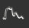
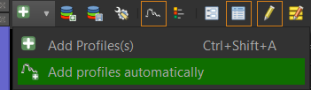
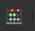
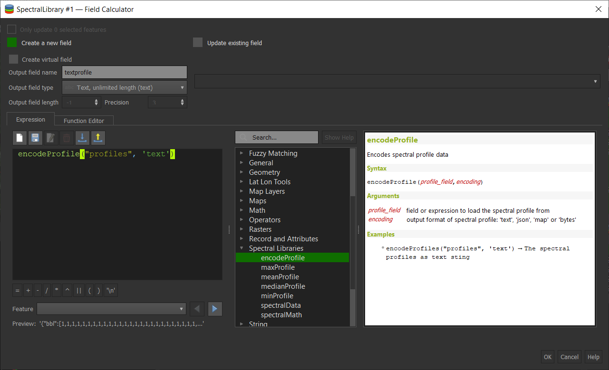
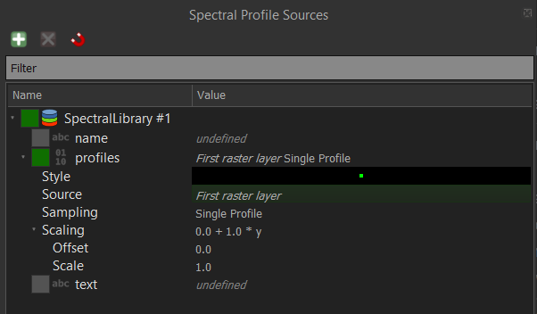

# Part II: Working with Spectral Libraries

This tutorial shows you to use Spectral Libraries in the EnMAP-Box.


## Collect raster profiles in a Spectral Library Window

1. Open the EnMAP-Box
2. Open an EnMAP image / any other raster image
3. Activate the "Identify map tool"  
and it's "Spectral Profile"  option 
4. Click on a raster image pixel to collect a spectral profile and show it in a new spectral library window.
5. Select other pixels to visualize their profiles

- To save a temporary profile, click on the add profile button
- To save each profile immediately, activate "Add profiles automatically"



## A Spectral Library is a vector layer

The EnMAP-Box stores spectral profiles on basis of QGIS Vector Layer

- you can add, modify and remove fields as known from other vector layers.
- spectral profiles are stored in binary or text field attributes
- spectral profile fields are designated to a Spectral Profile editor widget 

1. Open the Spectral Library properties
2. 
3. Open the layer properties of the Spectral Library
Each vector layer can become a spectral library

4. Open the field calculator 
5. Create a new field text field "textprofile" with unlimited length
6. Convert the binary encoded profile values into a JSON text string with the `encodeProfile` function:



## The Spectral Profile Plot

1. Open the Plot Settings
2. 


## Create a 2nd empty Spectral Library Window


Let's add profiles to the 2nd library.


## The Spectral Profile Source Panel

The spectral profile source panel controls how to:
- read spectral profiles from raster images 
- add these profiles as new features to existing spectral libraries
- describe additional attributes of new profile features

Open the spectral profile source panel and expand all nodes:



- modify the profile source
- change the sampling mode to mean profile that aggregated the profiles from a "3x3 Kernel" 
- modify the plot style that is used for temporary profiles
- modify the profile scale and offset
- enable other attributes that are automatically written to a new profile 


## The EnMAP-Box Spectral Library Model

A spectral library is a QGIS vector layer that contains one or more fields that store spectral profiles.
A spectral profile field is a field of 
    (i) type binary (BLOB) or text (VARCHAR, unlimited) that is designated to a 
    (ii) Spectral Profile editor widget

=> your vector layer can contain other BLOB field, e.g. to store picture

A single spectral profile is a JSON object with an array "y" that contains n > 0 spectral profile values:

````json
{
    "y": [34, 23, 45, 63, 45]
}
````

In addition, the JSON object can described the "y" values by their position on an "x" axis (e.g. the wavelength), 
unit name of the "y" and "x" values and (for convenience with the ENVI format), bad band values:

| member | content                                                                                    |
|--------|:-------------------------------------------------------------------------------------------|
| y      | an array with n profile values                                                             |
| x      | an array with n profile value locations, e.g. the band wavelengths                         |
| yUnit  | string that describes the unit of y values, e.g. "Reflectance"                             |
| xUnit  | string that describes the x value unit, e.g. "nm" or "Nanometers"                          |
| bbl    | a "bad band list", i.e. a vector with n bad-band multipliers. 0 = masked, > 0 = not masked |


Other metadata to describe spectra profiles are stored in additional vector layer fields.

This is how an EnMAP profile may look like:
````json
{"bbl":[1,1,1,1,1,1,1,1,1,1,1,1,1,1,1,1,1,1,1,1,1,1,1,1,1,1,1,1,1,1,1,1,1,1,1,1,1,1,1,1,1,1,1,1,1,1,1,1,1,1,1,1,1,1,1,1,1,1,1,1,1,1,1,1,1,1,1,1,1,1,1,1,1,1,1,1,1,1,1,1,1,1,1,1,1,1,1,1,1,1,1,1,1,1,1,1,1,1,1,1,1,1,1,1,1,1,1,1,1,1,1,1,1,1,1,1,1,1,1,1,1,1,1,1,1,1,1,1,1,1,1,1,1,1,1,1,1,1,1,1,1,1,1,1,1,1,1,1,1,1,1,1,1,1,1,1,1,1,1,1,1,1,1,1,1,1,1,1,1,1,1,1,1,1,1,1,1],
  "x":[0.46,0.465,0.47,0.475,0.479,0.484,0.489,0.494,0.499,0.503,0.508,0.513,0.518,0.523,0.528,0.533,0.538,0.543,0.549,0.554,0.559,0.565,0.57,0.575,0.581,0.587,0.592,0.598,0.604,0.61,0.616,0.622,0.628,0.634,0.64,0.646,0.653,0.659,0.665,0.672,0.679,0.685,0.692,0.699,0.706,0.713,0.72,0.727,0.734,0.741,0.749,0.756,0.763,0.771,0.778,0.786,0.793,0.801,0.809,0.817,0.824,0.832,0.84,0.848,0.856,0.864,0.872,0.88,0.888,0.896,0.915,0.924,0.934,0.944,0.955,0.965,0.975,0.986,0.997,1.007,1.018,1.029,1.04,1.051,1.063,1.074,1.086,1.097,1.109,1.12,1.132,1.144,1.155,1.167,1.179,1.191,1.203,1.215,1.227,1.239,1.251,1.263,1.275,1.287,1.299,1.311,1.323,1.522,1.534,1.545,1.557,1.568,1.579,1.59,1.601,1.612,1.624,1.634,1.645,1.656,1.667,1.678,1.689,1.699,1.71,1.721,1.731,1.742,1.752,1.763,1.773,1.783,2.044,2.053,2.062,2.071,2.08,2.089,2.098,2.107,2.115,2.124,2.133,2.141,2.15,2.159,2.167,2.176,2.184,2.193,2.201,2.21,2.218,2.226,2.234,2.243,2.251,2.259,2.267,2.275,2.283,2.292,2.3,2.308,2.315,2.323,2.331,2.339,2.347,2.355,2.363,2.37,2.378,2.386,2.393,2.401,2.409],
  "xUnit":"Micrometers",
  "y":[405,397,412,410,402,413,421,427,444,446,445,445,476,491,495,504,504,519,532,530,536,539,533,527,529,527,529,526,530,524,520,521,522,523,507,514,505,502,494,497,543,603,703,769,845,930,1007,1096,1178,1249,1314,1359,1388,1386,1419,1432,1432,1435,1471,1498,1479,1487,1482,1499,1507,1517,1509,1534,1532,1507,1557,1527,1552,1605,1534,1555,1577,1564,1582,1600,1611,1643,1659,1678,1684,1672,1687,1659,1697,1624,1612,1602,1576,1515,1508,1513,1522,1542,1575,1602,1632,1649,1663,1639,1602,1587,1530,977,996,1026,1063,1086,1108,1123,1169,1177,1191,1194,1210,1222,1208,1201,1187,1182,1146,1157,1112,1093,1085,1096,1058,1041,754,781,804,796,780,792,812,825,851,803,812,836,834,818,823,842,842,860,851,880,844,856,847,846,819,842,820,754,768,731,728,750,695,735,675,718,640,601,684,744,635,568,696,637,592]}
````

## Spectral Libraries are Vector Layers

This implies that we save spectral profiles to (almost) all vector formats which can be modified by QGIS.


## 2 how to make a vector layer a Spectral Library


## 3. Import Spectral Profiles measured in field


## 4. Save the spectral library 