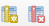

# Part II: Working with Spectral Libraries

This tutorial shows you how to use Spectral Libraries in the EnMAP-Box.


## Collecting profiles from raster positions

### Identify and collect
1. Open the EnMAP-Box
2. Open an EnMAP image / any other raster image
3. Activate the *Identify* map tool and it's option to collect *Profiles* 
   

4. Click on a raster image pixel to open a new Spectral Library window and show the pixel profile.

   

5. Profiles obtained from pixel positions are considered as current or temporary *profile candidates*. 
   Each time you click on a new pixels position, the last candidate will be replaced by the next one.

6. Click on *Add profile(s)" to keep candidate profiles in the spectral library.
   You can activate "Add profiles automatically" to keep new profiles automatically

   
 

## Vector Layer as Spectral Library

The EnMAP-Box stores spectral profiles in vector layers. This way you can save profile metadata in the same way 
as in other vector datasets. This way we can describe

* profile locations using geometries like points and polygons
* profile metadata using different [field types](https://docs.qgis.org/3.22/en/docs/user_manual/managing_data_source/supported_data.html),
  for example for text and numeric data.
* use QGIS specific features and constraints to ensure data consistency and integrity

1. Open the *Layer properties* of the Spectral Library. Now have a look on different layer properties
  - *Information*: Which data provider does this Spectral Library use?
  - *Source*: Change the spectral library name to "MySpeclib"
  - *Fields*: Which data type is used for the *profiles* field? 
  - *Attribute Form*: Which widget type is used for the *profiles field?

*Spectral Profiles* are stored in *binary* (BLOB) or *text* (VARCHAR) fields of unlimited length. 
To use such fields for storing Spectral Profiles, the field editor 
widget must be explicitly designated to the type *SpectralProfile*.


Being a vector layer, we can add the spectral library to a map canvas to display the 
positions of collected pixel profiles.

1. Close the *Layer properties*
2. Open a map canvas context menu
3. Add "MySpeclib" as vector layer

 

## Profile sources and pixel locations

You may have recognized that, by default, the *Identify* tool selects profiles from top-most raster layer.
This can be change in the *Spectral Profile Sources* panel, which allows you to define:

* the profile source, i.e. the raster layer to collect profiles from
* the style how they appear in the profile plot as profile candidate
* the sampling method, for example to aggregate multiple pixel into a single profile first
* the scaling of profile value

1. Change the profile source to *enmap_berlin.bsq*. This way you will always collect profiles from the same image.
   

2. In addition, open the map context menu *Crosshair* > *Pixel grid* and select the *enmap_berlin.bsq*. 

   

   

   Continue identifying pixel profiles by selecting locations using the *hires_berlin.bsq* as reference.
   As alternative to the mouse you can use the following short-cuts to identify pixel profiles:

   | Shortcut     | Action                                   | 
   |--------------|------------------------------------------|
   | Arrow        | Move the map                             |
   | CTRL + Arrow | Select next pixel in arrow direction     |
   | CTRL + S     | Add the selected pixel profile candidate |


It is possible to collect and compare profiles from different raster sources at the same time.
1. Add a second profile source relation 
2. Use ```hires_berlin.bsq``` as profile source and identify a profile for both images
   
   
3. You can compare profiles from the same raster image using a different sampling methods.
   Change the second relation to sample from ``enmap_berlin.bsq`` using a 3x3 Kernel mean profile.
4. 

## The Spectral Library Window

The Spectral Library window offers similar tools like the standard QGIS attribute 
table and enhances it by views and features specific to spectral profiles.


- Activate and deactivate the different views to explore what they are used for 
- Ensure that the *Edit mode* is activated .
### Table View 

 The *Table View* can be used to modify profile attributes, for example the values in the *name* column.


You may also use the field calculator  to values in the *name* field based on an expression.
   

 
QGIS tracks modifications in an internal buffer. Call *Save edits* to write modifications to the vector layer.
Alternatively, you can reject modifications when leaving the edit mode. This will reset the vector layer to it's 
last saved state.  


### Form View

 The *Form View* uses the widgets that have been specified in the 
*layer properties* > *Attribute Form* to display attribute values. If can be used to display and
(in edit mode) modify profiles in a JSON or table view.
   


### Profile Plot

The *Profile Plot* displays spectral profiles. Toggle the  icon to show or hide the plot 
panel, e.g. to enlarge the attribute table if you focus on modifications of the attributes.  

### Plot Settings

 The *Plot settings* control the profile visualization.
You can define multiple visualization groups that described how profiles from a specific field and with specific attributes
should be visualized. 

1. Open a second spectral library viewer that displays the ``library_berlin.gpkg``
   Go to the Data Source panel, open the ``library_berlin.gpkg`` context menu  and click *Open Spectral Library Viewer*
2. Open the *Plot Settings*  
3. Open the Plot Settings
4. Rename the name of the default visualization group to *vegetation* (double-click into the name)
5. Set a filter expression to show vegetation profiles only, e.g. ``"level_1" = 'vegetation'``
   
6. Change the profile color to green

   

7. Add a second visualization group  for `impervious surfaces`, using a red color.

   


## 6. Save a Spectral Libraries

Saving a spectral library means to save a vector file.

In case your spectral library already uses a file backend, this is done when closing the edit mode.

Note that layer or style specific modifications may require to save them in a *.qml file. This can be done 
openning the layer properties > *Symbology* > *Style* > *Save Default*


In case your spectral library uses the in-memory data provider 
(this is the case when opening a new spectral library window), you need to export it into a file format first.
This is preferably done by exporting 1. Open the export dialog 
 the entire library as Geopackage (*.gpkg) file.   

## 7. Export profiles

The Export dialog allows you to export all or selected profiles as
Geopackage (*.gpkg), GeoJSON (*.geoson) or ENVI Spectral Library (*.sli).

The ENVI Spectral Library does not allow to save profiles together that differ in their number of bands.
In that case, a file will be generated for each profile field and for each unique setting wavelength and wavelength units.  

## 8. Import profiles

 The Import Dialog allows you to import profile from different file types

1. Open a new "empty" spectral library window
2. Activate the edit mode and remove the "profiles" field
3. Open the import dialog 
4. Select "ASD Field Spectrometer"
5. Select the ASD files in ``Data_Part_II\ASD``
   
   So far, the source files contain more attributes than we define in our spectral library. 
   Add the *Reference* and the *Spectrum* field using the *Copy missing source fields* dialog
6. Now define how attribute values from the source, i.e. each single ``*.asd`` file, will be mapped to attribute 
   in the spectral library. Press *Ok* to import the ASD file profiles.
7. Add the libary to the map canvas to visualize the GPS positions
8. Finally, use the plot settings menu to give reference and spectrum profiles a different color
   
   
## 9. Spectral profiles (advanced)

The EnMAP-Box stores the minimum data to plot a single profile in a JSON object. 
In its most simple way, this JSON object contains a single array "y" of length n, with n = number of spectral 
profile values:

````json
{
    "y": [34, 23, 45, 63, 45]
}
````

In this case it can be assumed that the corresponding `'x'` values are an increasing band index `"x": [0, 1, 2, 3, 4]` 

The JSON object can describe the `"x"`, the axis units and a vector of bad band values explicitly:

| member | content                                                                                    |
|--------|:-------------------------------------------------------------------------------------------|
| y      | an array with n profile values                                                             |
| x      | an array with n profile value locations, e.g. the band wavelengths                         |
| yUnit  | string that describes the unit of y values, e.g. "Reflectance"                             |
| xUnit  | string that describes the x value unit, e.g. "nm" or "Nanometers"                          |
| bbl    | a "bad band list", i.e. a vector with n bad-band multipliers. 0 = masked, > 0 = not masked |


Other metadata to describe spectra profiles are stored in additional vector layer fields.

As JSON objet, a single hyperspectral EnMAP profile may therefore look like:
````json
{"bbl":[1,1,1,1,1,1,1,1,1,1,1,1,1,1,1,1,1,1,1,1,1,1,1,1,1,1,1,1,1,1,1,1,1,1,1,1,1,1,1,1,1,1,1,1,1,1,1,1,1,1,1,1,1,1,1,1,1,1,1,1,1,1,1,1,1,1,1,1,1,1,1,1,1,1,1,1,1,1,1,1,1,1,1,1,1,1,1,1,1,1,1,1,1,1,1,1,1,1,1,1,1,1,1,1,1,1,1,1,1,1,1,1,1,1,1,1,1,1,1,1,1,1,1,1,1,1,1,1,1,1,1,1,1,1,1,1,1,1,1,1,1,1,1,1,1,1,1,1,1,1,1,1,1,1,1,1,1,1,1,1,1,1,1,1,1,1,1,1,1,1,1,1,1,1,1,1,1],
  "x":[0.46,0.465,0.47,0.475,0.479,0.484,0.489,0.494,0.499,0.503,0.508,0.513,0.518,0.523,0.528,0.533,0.538,0.543,0.549,0.554,0.559,0.565,0.57,0.575,0.581,0.587,0.592,0.598,0.604,0.61,0.616,0.622,0.628,0.634,0.64,0.646,0.653,0.659,0.665,0.672,0.679,0.685,0.692,0.699,0.706,0.713,0.72,0.727,0.734,0.741,0.749,0.756,0.763,0.771,0.778,0.786,0.793,0.801,0.809,0.817,0.824,0.832,0.84,0.848,0.856,0.864,0.872,0.88,0.888,0.896,0.915,0.924,0.934,0.944,0.955,0.965,0.975,0.986,0.997,1.007,1.018,1.029,1.04,1.051,1.063,1.074,1.086,1.097,1.109,1.12,1.132,1.144,1.155,1.167,1.179,1.191,1.203,1.215,1.227,1.239,1.251,1.263,1.275,1.287,1.299,1.311,1.323,1.522,1.534,1.545,1.557,1.568,1.579,1.59,1.601,1.612,1.624,1.634,1.645,1.656,1.667,1.678,1.689,1.699,1.71,1.721,1.731,1.742,1.752,1.763,1.773,1.783,2.044,2.053,2.062,2.071,2.08,2.089,2.098,2.107,2.115,2.124,2.133,2.141,2.15,2.159,2.167,2.176,2.184,2.193,2.201,2.21,2.218,2.226,2.234,2.243,2.251,2.259,2.267,2.275,2.283,2.292,2.3,2.308,2.315,2.323,2.331,2.339,2.347,2.355,2.363,2.37,2.378,2.386,2.393,2.401,2.409],
  "xUnit":"Micrometers",
  "y":[405,397,412,410,402,413,421,427,444,446,445,445,476,491,495,504,504,519,532,530,536,539,533,527,529,527,529,526,530,524,520,521,522,523,507,514,505,502,494,497,543,603,703,769,845,930,1007,1096,1178,1249,1314,1359,1388,1386,1419,1432,1432,1435,1471,1498,1479,1487,1482,1499,1507,1517,1509,1534,1532,1507,1557,1527,1552,1605,1534,1555,1577,1564,1582,1600,1611,1643,1659,1678,1684,1672,1687,1659,1697,1624,1612,1602,1576,1515,1508,1513,1522,1542,1575,1602,1632,1649,1663,1639,1602,1587,1530,977,996,1026,1063,1086,1108,1123,1169,1177,1191,1194,1210,1222,1208,1201,1187,1182,1146,1157,1112,1093,1085,1096,1058,1041,754,781,804,796,780,792,812,825,851,803,812,836,834,818,823,842,842,860,851,880,844,856,847,846,819,842,820,754,768,731,728,750,695,735,675,718,640,601,684,744,635,568,696,637,592]}
````

Note that conceptually profile objects can differ in its wavelength etc.


## 2 how to make a vector layer a Spectral Library


## 3. Import Spectral Profiles measured in field


## 4. Save the spectral library 