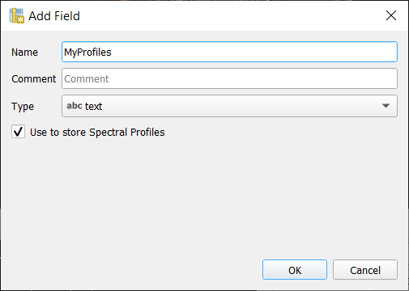
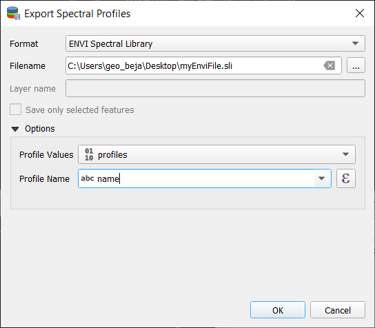

# Part II: Working with Spectral Libraries

This tutorial shows example on how the EnMAP-Box can be used to manage Spectral Libraries.


## Requirements

* QGIS 3.24+ 
* EnMAP.Box 3.10.+

Most exercises of this tutorial use the EnMAP-Box example data, which can be opened by
*Project* > *Load Example Data*.


Some exercises use ASD Field Spectrometer binary files (*.asd), which are located 
in this repository in ``enmapbox-training/EARSeL2022/Data_Part_II``. You may:

* clone this repository ``git clone git@github.com:EnMAP-Box/enmapbox-training.git``, or
* download it from [https://github.com/EnMAP-Box/enmapbox-training/archive/refs/heads/main.zip](https://github.com/EnMAP-Box/enmapbox-training/archive/refs/heads/main.zip)

It is furthermore recommended to disable other QGIS plugins.
An easy way doing so is to create a new QGIS profile "enmap-box tutorial" and install a 
fresh EnMAP-Box installation to.


## 1. Collect profiles

1. Open the EnMAP-Box and load the example data from *Project* > *Load Example Data*.

   If not done automatically, open a new map view and add the ``enmap_berlin.bsq`` and ``hires_berlin.bsq`` to it.
2. Activate the *Identify* map tool and it's option to collect *Profiles* 
   

3. Click on a raster image pixel to open a new Spectral Library window and show the pixel profile.

   

4. Profiles obtained from pixel positions are considered as current or temporary *profile candidates*. 
   The last profile candidate will be replaced by a new one each time you click on a new pixel position.

5. Click on *Add profile(s)* to keep candidate profiles in the spectral library.
   You can activate *Add profiles automatically* to keep new profiles automatically in the spectral library.

   
 

## 2. Profiles in Vector Layers?

The EnMAP-Box stores spectral profiles in vector layers. This way we can:

* describe profile locations using geometries like points and polygons
* describe profile metadata using different [field types](https://docs.qgis.org/3.22/en/docs/user_manual/managing_data_source/supported_data.html),
  for example for text and numeric data.
* use QGIS specific features and constraints to ensure data consistency and integrity

Open the *Layer properties* of the Spectral Library and have a look on 
its different properties:
  - *Information*: Which data provider does this Spectral Library use?
  - *Source*: Change the spectral library name to *MySpeclib*
  - *Fields*: Which data type is used for the *profiles* field? 
  - *Attribute Form*: Which widget type is used for the *profiles* field?

*Spectral Profiles* are stored in *binary* (BLOB) or *text* (VARCHAR) fields of unlimited length. 
These field types may be used for other purposes as well. To use them explicitly for Spectral Profiles, 
the field editor widget type must be set to *SpectralProfile*.


Because EnMAP-Box spectral libraries are vector layers, we can add them to a map canvas and display the 
positions of collected pixel profiles.

1. Close the *Layer properties*
2. Open a map canvas context menu
3. Add "MySpeclib" as vector layer

 

## 3. Profile sources and pixel locations

The *Identify* tool selects profiles from top-most raster layer by default.
The *Spectral Profile Sources* panel allows to change this behaviour and to control:

* the profile source, i.e. the raster layer to collect profiles from
* the style how they appear in the profile plot as profile candidate
* the sampling method, for example to aggregate multiple pixel into a single profile first
* the scaling of profile value

1. Change the profile source to *enmap_berlin.bsq*. This way you will always collect profiles from the same image.
   

2. In addition, open the map context menu *Crosshair* > *Pixel grid* and select the *enmap_berlin.bsq*. 

   

   

3. Continue identifying pixel profiles by selecting locations using the *hires_berlin.bsq* as reference.
   As an alternative to the mouse you may use the short-cuts to change the pixel positions:

   | Shortcut     | Action                                   | 
   |--------------|------------------------------------------|
   | Arrow        | Move the map                             |
   | CTRL + Arrow | Select next pixel in arrow direction     |
   | CTRL + S     | Add the selected pixel profile candidate |


It is possible to collect and compare profiles from different raster sources at the same time:

1. Add a second profile source relation 
2. Use ```hires_berlin.bsq``` as profile source and identify a profile for both images
3. Collect new pixel profiles

   

In a similar way you can compare profiles from the same raster image but using a different sampling methods.

1. Change the second relation to sample from ``enmap_berlin.bsq`` using a 3x3 Kernel mean profile.
2. Collect new pixel profiles
   

## 4. The Spectral Library Window

The Spectral Library window offers (almost) the same tools like the standard QGIS attribute 
table. In addition, it provides views and features specifically to visualize and manage spectral profiles.


- Toggle the buttons to show or hide the *Plot View*, *Plot Settings*, *Table View* and *Form View*
- Ensure that the *Edit mode* is activated .

### 4.1.  Table View 

The *Table View* can be used to modify profile attributes. Use it (in edit mode) to change the values in 
the *name* column.


You can add further metadata fields:

1. Click the  button to open the *Add Field* dialog.
2. Select a data type that allows to store profiles (e.g. text or binary fields)
3. Checking *Use to store Spectral Profiles* is a fast way to create a new profile field, as it will set 
   the editor widget automatically to *Spectral Profile*.
   

You can remove fields:

1. Click on  to open the Remove Fields dialog.
2. Select fields that you like to remove and press *Ok*   

You can use the field calculator  to modify values in the *name* field using an expression.
  
 
QGIS uses a transactional model to tracks modifications in an internal buffer. 
* Call *Save edits* to write modifications to the vector layer's data source. 
* To reject your modifications, stop the edit mode and click *No*.  
  

### 4.2. Form View

 The *Form View* uses the widgets that have been specified in the 
*layer properties* > *Attribute Form* to display attribute values. If can be used to display and
(in edit mode) modify profiles in a JSON or table view.
   


### 4.3. Profile Plot

The *Profile Plot* displays spectral profiles. 
Toggling the  icon shows or hides the plot 
panel. This can be useful, for example to enlarge the attribute table and focus on attribute modifications.  

You can adjust the extent of the visualized data range
* in the plot context menu 
  

* using the mouse cursor while with keeping the right mouse button pressed (try it!)

* using the *Auto Scale* button in the lower-left plot corner
  

You can export the entire plot scene or visible view box using the *context menu* > *Export*


### 4.4. Plot Settings

 The *Plot settings* control the profile visualization.
You can define multiple visualization groups that described how profiles from a specific field and with specific attributes
should be visualized. 


1. Open a second spectral library viewer that displays the ``library_berlin.gpkg``
   Go to the Data Source panel, open the ``library_berlin.gpkg`` context menu  and click *Open Spectral Library Viewer*
2. Open the *Plot Settings* 
3. Rename the name of the default visualization group to *vegetation* (double-click into the name)
4. Set a filter expression to show vegetation profiles only, e.g. ``"level_1" = 'vegetation'``
   
5. Change the profile color to green
6. Add a second visualization group  for `impervious surfaces`, using a red color.
   


## 5. Load and Save Spectral Libraries

Loading or Saving a spectral library means to load or save vector files.

- You can load any vector source in the *Data Source Panel* into a *Spectral Library Viewer*
  
  
  The vector layer does not need to contain any Spectral Profile fields. You can add or define them afterwards.

- If your spectral library uses an in-memory vector layer backend, all data will be lost if the layer is closed. 
  This is the case if the *Spectral Library Viewer* was opened from *scratch* with an empty spectral library 
  . In this case, don't forget to export collected profiles before 
  closing the Spectral Library Viewer.

- If your spectral library already uses a file backend (e.g. *.gpkg, *.geojson)

Style and other layer specific information are not saved in the data source file, but the QGIS project or a QGIS specific
sidecar *.qml file. Open the layer properties > *Symbology* > *Style* > *Save Default* to create or update the *.qml 
file and ensure that the *Spectral Profile* fields will be restored when re-opening the data set.


## 6. Export profiles

The Export dialog allows you to export all or selected profiles as
Geopackage (*.gpkg), GeoJSON (*.geoson) or ENVI Spectral Library (*.sli).



The ENVI Spectral Library does not allow saving profiles with different spectral settings 
(number of bands, wavelength units, FWHM, ...) in the same file. 
Therefore, you need to select one (out of multiple) profile fields. 
Profile with different spectral settings will be exported into different ENVI files. 


## 7. Import profiles

 The Import Dialog is used to load profiles from none-vector files into an existing
spectral library.

1. Open a new "empty" spectral library window 
2. Activate the edit mode and remove the "profiles" field
3. Open the import dialog 
4. Select "ASD Field Spectrometer"
5. Select the ASD files in ``Data_Part_II\ASD``

  

   The source files contain more attributes than we have defined in our spectral library. 
   Add the *Reference* and the *Spectrum* field using the *Copy missing source fields* dialog.

6. Define how source attributes, i.e. attributes of a single ``*.asd`` file are mapped to 
   attributes of the spectral library. Press *Ok* to import the ASD file profiles.
7. Add the library to the map canvas to visualize the GPS positions
8. Finally, use the plot settings menu to give reference and spectrum profiles a different color
   
   

## 8. Spectral Profile JSON format

The EnMAP-Box stores the minimum data to plot a single profile in a JSON object. 
In its most simple way, this JSON object contains a single array "y" of length n, with n = number of spectral 
profile values:

````json
{
    "y": [34, 23, 45, 63, 45]
}
````

In this case it can be assumed that the corresponding `'x'` values are an increasing band index `"x": [0, 1, 2, 3, 4]` 

The JSON object can describe the `"x"`, the axis units and a vector of bad band values explicitly:

| member | content                                                                                    |
|--------|:-------------------------------------------------------------------------------------------|
| y      | an array with n profile values                                                             |
| x      | an array with n profile value locations, e.g. the band wavelengths                         |
| yUnit  | string that describes the unit of y values, e.g. "Reflectance"                             |
| xUnit  | string that describes the x value unit, e.g. "nm" or "Nanometers"                          |
| bbl    | a "bad band list", i.e. a vector with n bad-band multipliers. 0 = masked, > 0 = not masked |


Other metadata to describe spectra profiles are stored in additional vector layer fields.

As JSON objet, a single hyperspectral EnMAP profile may therefore look like:
````json
{"bbl":[1,1,1,1,1,1,1,1,1,1,1,1,1,1,1,1,1,1,1,1,1,1,1,1,1,1,1,1,1,1,1,1,1,1,1,1,1,1,1,1,1,1,1,1,1,1,1,1,1,1,1,1,1,1,1,1,1,1,1,1,1,1,1,1,1,1,1,1,1,1,1,1,1,1,1,1,1,1,1,1,1,1,1,1,1,1,1,1,1,1,1,1,1,1,1,1,1,1,1,1,1,1,1,1,1,1,1,1,1,1,1,1,1,1,1,1,1,1,1,1,1,1,1,1,1,1,1,1,1,1,1,1,1,1,1,1,1,1,1,1,1,1,1,1,1,1,1,1,1,1,1,1,1,1,1,1,1,1,1,1,1,1,1,1,1,1,1,1,1,1,1,1,1,1,1,1,1],
  "x":[0.46,0.465,0.47,0.475,0.479,0.484,0.489,0.494,0.499,0.503,0.508,0.513,0.518,0.523,0.528,0.533,0.538,0.543,0.549,0.554,0.559,0.565,0.57,0.575,0.581,0.587,0.592,0.598,0.604,0.61,0.616,0.622,0.628,0.634,0.64,0.646,0.653,0.659,0.665,0.672,0.679,0.685,0.692,0.699,0.706,0.713,0.72,0.727,0.734,0.741,0.749,0.756,0.763,0.771,0.778,0.786,0.793,0.801,0.809,0.817,0.824,0.832,0.84,0.848,0.856,0.864,0.872,0.88,0.888,0.896,0.915,0.924,0.934,0.944,0.955,0.965,0.975,0.986,0.997,1.007,1.018,1.029,1.04,1.051,1.063,1.074,1.086,1.097,1.109,1.12,1.132,1.144,1.155,1.167,1.179,1.191,1.203,1.215,1.227,1.239,1.251,1.263,1.275,1.287,1.299,1.311,1.323,1.522,1.534,1.545,1.557,1.568,1.579,1.59,1.601,1.612,1.624,1.634,1.645,1.656,1.667,1.678,1.689,1.699,1.71,1.721,1.731,1.742,1.752,1.763,1.773,1.783,2.044,2.053,2.062,2.071,2.08,2.089,2.098,2.107,2.115,2.124,2.133,2.141,2.15,2.159,2.167,2.176,2.184,2.193,2.201,2.21,2.218,2.226,2.234,2.243,2.251,2.259,2.267,2.275,2.283,2.292,2.3,2.308,2.315,2.323,2.331,2.339,2.347,2.355,2.363,2.37,2.378,2.386,2.393,2.401,2.409],
  "xUnit":"Micrometers",
  "y":[405,397,412,410,402,413,421,427,444,446,445,445,476,491,495,504,504,519,532,530,536,539,533,527,529,527,529,526,530,524,520,521,522,523,507,514,505,502,494,497,543,603,703,769,845,930,1007,1096,1178,1249,1314,1359,1388,1386,1419,1432,1432,1435,1471,1498,1479,1487,1482,1499,1507,1517,1509,1534,1532,1507,1557,1527,1552,1605,1534,1555,1577,1564,1582,1600,1611,1643,1659,1678,1684,1672,1687,1659,1697,1624,1612,1602,1576,1515,1508,1513,1522,1542,1575,1602,1632,1649,1663,1639,1602,1587,1530,977,996,1026,1063,1086,1108,1123,1169,1177,1191,1194,1210,1222,1208,1201,1187,1182,1146,1157,1112,1093,1085,1096,1058,1041,754,781,804,796,780,792,812,825,851,803,812,836,834,818,823,842,842,860,851,880,844,856,847,846,819,842,820,754,768,731,728,750,695,735,675,718,640,601,684,744,635,568,696,637,592]}
````

Note that conceptually profile objects can differ in its wavelength etc.

## 9. Create/Modify Profiles with spectralMath

As you already know, the *Field Calculator* can modify attribute values of all or selected
features (aka *rows*).

We can use it to calculate spectral profiles as well:

1. Open the *Table View* and activate the layer *Edit mode*
2. Create a new Spectral Profile field based on a text field called "Reflectance"
   
3. Open the field calculator  
4. Use the ``spectralMath`` function to calculate reflectances from the ASD radiances measured 
   from field spectra and its corresponding white reference.

   ````bash
   spectralMath("<profile field 1>", ..., "<profile field n>",
   '<python code>', '<output format>')
   
   spectralMath("Spectrum",  "Reference",
   'y = y1 / y2', 'text')
   ````
   
   The last function argument defines the output format. As our "Reflectance" field is based on text field, 
   we need to specify the function output as "text" as well. 
    
   

5. Press "ok" to calculate the reflectance values.
6. Hide the plot visualizations for "Reflectance" and "Spectrum" and auto-scale to the  
   reflectance values within the range 0 to 1.

   


## 10.  Spectral Processing

### Concept


The Spectral Processing framework allows you to use raster processing algorithms to create 
new profiles. Field values of your spectral library will be 
converted into artificial one-line raster images. In principally, this can be 
done with most of the field types:

| Field Type       | Raster Size <br/>(band, height, n)  | type                 |
|------------------|-------------------------------------|----------------------|
| Spectral Profile | nb, 1, n                            | int / float          |
| integer          | 1, 1, n                             | int                  |
| float            | 1, 1, n                             | float                |
| text             | 1, 1, n                             | int (classification) |


These temporary raster images are input to standard QGIS processing 
algorithms or QGIS processing models. If they generate raster outputs, these outputs
can be converted back into field values of the spectral library: 

| Raster Output        | Speclib Field Type |
|----------------------|--------------------|
| (>1, 1, n) int/float | Spectral Profile   |
| (1, 1, n) int        | int                |
| (1, 1, n) float      | float              |


This allows you to use the same algorithms to modify spectral profiles as you may want to use
to manipulate raster images. Furthermore, you can make use 
the QGIS model builder to create (potentially very large and complex) models and use them for
both, spectral libraries and raster image processing.

# Example

1. Open the ```library_berlin.gpkg``` in a Spectral Library Viewer
2. Activate the layer *Edit mode*.
3. Open the *Spectral Processing Dialog* 
   - select *Spectral Resampling to Landsat8* (`enmapbox:SpectralResamplingToLandsat89Oli`) 
     as processing algorithm
   - select *profiles (177 bands, Micrometer)* as input. These profiles
     will be converted into a single line raster image with 177 bands.
   - define the field where to write outputs to. Either select an existing field 
     or type the name of a new one.
   
   

4. Press *Ok* to start the processing.

   (Bug notice: run this step twice)

5. Close the Spectral Processing Dialog, open the plot settings and visualize the 
   resampled *Landsat* profiles.

   

## Caveats & Limitations

- to create new or modify existing profile, the spectral processing approach requires
  raster outputs of same height and width as used for input images.

- spectral processing can be started for a single spectral setting per spectral profile field only.
  Assuming you have a field *profiles* which contains two types of profiles with 177 bands and (ii)


## References

EnMAP-Box Source Code: [https://bitbucket.org/hu-geomatics/enmap-box](https://bitbucket.org/hu-geomatics/enmap-box)

EnMAP-Box Documentation: [https://enmap-box.readthedocs.io](https://bitbucket.org/hu-geomatics/enmap-box)

QGIS User Guide: [https://docs.qgis.org/latest/en/docs/user_manual/index.html](https://docs.qgis.org/latest/en/docs/user_manual/index.html)
